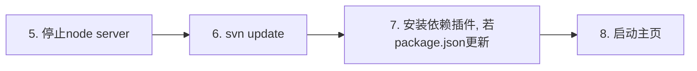

Poseidon主页作为介绍Poseidon如何安装及使用的网页，不同于Element主页(http://element.eleme.io)，它是以==node==作为http server，而不是apache或nginx。这么做的原因主要有两个：
1. 方便开发人员调试。  
打开游览器调试工具（vue-devtool），就可以直接看到里面的组件实例运行时状态（路由、变量等）。
2. 快速更新。  
直接运行从svn下载的代码，没有压缩和额外部署过程。当主页代码有更新时，只要执行svn update，然后重启node server即可。  

---
下面介绍传统部署方式和docker部署的区别，以及docker部署的具体实现。

## 部署流程
### 传统  
启动主页

更新主页




### docker

启动主页

更新主页


### 两种方式对比
- 优点  
从整体来看，docker部署比传统部署方式在启动、更新上都更简单，尤其是在更新时。实际上，docker部署方式还更加快速。传统方式的步骤2、3的时间开销通常在15分钟左右。而docker方式的下载poseidon镜像的时间只要1分钟左右。
- 缺点  
poseidon主页每次更新，都需要重启容器。而每次启动容器都需要等待几分钟（启动node server）。实际上，由于存在热部署，一些更新是不需要重启server的，这时候传统方式就比较快捷。不过，docker这种重启容器来更新网页的方式还是非常酷的=！=

## docker部署
### sketch
包含镜像的制作和容器启动两个部分。  
实际上，镜像中包含了传统方式的步骤2、3，即：  

---
**posedion镜像** = 从svn上下载主页源代码 + 安装依赖插件。  

---

当我们下载好镜像后，就已经完成了poseidon主页源代码下载和依赖插件的安装。
相应地，容器启动时，会去执行传统方式的步骤6、7、8，即：

---
**启动容器** = svn update + 安装依赖插件, 若package.json更新 + 启动主页

---

### 具体实现
#### Dockerfile
基于[node官方镜像](https://hub.docker.com/_/node/)制作。
- Dockerfile
```
FROM node:8
WORKDIR /app
#安装脚本
COPY install.sh /app
# 配置镜像源
RUN mv /etc/apt/sources.list /etc/apt/sources.list.bak && \
    echo "deb http://mirrors.163.com/debian/ jessie main non-free contrib" >/etc/apt/sources.list && \
    echo "deb http://mirrors.163.com/debian/ jessie-proposed-updates main non-free contrib" >>/etc/apt/sources.list && \
    echo "deb-src http://mirrors.163.com/debian/ jessie main non-free contrib" >>/etc/apt/sources.list && \
    echo "deb-src http://mirrors.163.com/debian/ jessie-proposed-updates main non-free contrib" >>/etc/apt/sources.list

RUN apt-get update && apt-get -y install net-tools
# 安装组件库及依赖
RUN chmod +x install.sh && ./install.sh

WORKDIR /app/FECompLibrary
#启动组件库脚本
COPY inrun.sh /app/FECompLibrary

EXPOSE 8085
CMD [ "sh", "inrun.sh" ]

```
- install.sh
下载Poseidon主页代码，并安装依赖插件。Dockerfile使用。
```
#!/bin/bash
#从svn上下载代码
set -x

#设置svn账号密码
svn_user=你的svn账号
svn_pass=你的svn密码

svn co http://svn.ruijie.net/svn/RCD/Brunches/FECompLibrary --username ${svn_user} --password ${svn_pass}

if [ $? -ne 0 ];then
    echo "svn账号密码不对"
    exit 1
fi

psdPath=`pwd`/FECompLibrary/poseidon
elePath=`pwd`/FECompLibrary/element

#安装依赖
cd ${elePath}
npm install
cd ${psdPath}
npm i element-ui-themecustom --registry http://172.21.149.14:4873
npm install node-sass --registry https://registry.npm.taobao.org
npm install phantomjs-prebuilt@2.1.14 --ignore-script
npm install
```
==注意==上面的svn账号、密码，node仓库ip（172.21.149.13），请根据实际替换为当前的值。

- inrun.sh  
启动容器时的执行脚本。会更新主页代码，安装依赖插件，并启动Poseidon。
```
#!/bin/bash
## ensure current path is /app/FECompLibrary 
set -x
#设置svn账号密码
svn_user=你的svn账号
svn_pass=你的svn密码

#设置宿主机ip，用来处理posedion和element间通信时的跨域问题
host_ip=172.21.149.13
#node仓库ip，该仓库存放了组件库
node_repo=''

svn update --username ${svn_user} --password ${svn_pass}

#获取容器ip
cip=`ifconfig -a|grep inet|grep -v 127.0.0.1|grep -v inet6|awk '{print $2}'|tr -d "addr:"`

#替换ip为容器ip
cd poseidon
sed -i "s/172.21.149.14/${host_ip}/" examples/index.tpl
sed -i "s/172.21.149.14/${host_ip}/" examples/thirdRepo.config.js
sed -i "s/172.21.149.14/${host_ip}/" examples/docs/zh-CN/icon.md

cd ../element
sed -i "s/172.21.149.14/${host_ip}/" examples/index.tpl

#替换node仓库ip，若有。注意默认端口不变，还是4873
if [ "$node_repo" != '' ];then
    :
    cd ../poseidon
    sed -i "s/172.21.149.14/${node_repo}/" examples/docs/zh-CN/custom-theme.md
    sed -i "s/172.21.149.14/${node_repo}/" examples/docs/zh-CN/installation.md
    sed -i "s/172.21.149.14/${node_repo}/" examples/docs/zh-CN/quickstart.md

fi


cd ../element
npm install
npm run dev&

cd ../poseidon
npm install
npm run dev

```
==注意==该脚本中，host_ip为当前宿主机ip，node_repo为组件库存放的node仓库ip，请根据需要更改。

#### 制作镜像
在Dockerfile所在目录，执行
```
#!/bin/bash
set -x
docker build -t poseidon:1.0  .
```
制作成功后，执行docker images查看该镜像
```
REPOSITORY                  TAG                 IMAGE ID            CREATED             SIZE
poseidon                    1.0                 c093c09dbcc7        7 minutes ago       1.27GB
```
==注意==：由于网络原因，制作过程中下载依赖插件可能会失败，请多试几次。

#### 运行容器
镜像生成后，执行
```
#!/bin/bash
docker run -d --name poseidon \
        -p 8085-8086:8085-8086 \
        --restart=always \
         poseidon:1.0
```
容器运行成功后，执行`docker ps`，可以看到正在运行的poseidon容器
```
CONTAINER ID        IMAGE                 COMMAND                  CREATED             STATUS              PORTS                                                                                NAMES
55207fb97f0c        poseidon:1.0          "sh inrun.sh"            5 minutes ago       Up 5 minutes        0.0.0.0:8085-8086->8085-8086/tcp                                                     poseidon

```

### 访问
容器运行成功后，访问所在机器的ip+端口号，（需要耐心再等待几分钟，等待node server的完全启动）  
如：  
http://172.21.149.13:8085