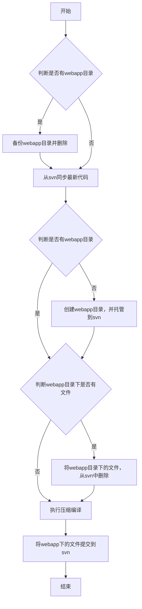

## 背景——————多人提交编译代码容易引发冲突  
现有很多项目采用vue+webpack构建，执行`npm run build`生成编译代码(通常是webapp)，该代码是压缩后的，如果是不同的开发人员提交，很容易出现代码冲突,此时需要本地下载最新代码，并将其从svn库删除，然后重新提交新代码：

1.开发小A执行`npm run build`生成webapp(版本1), 并提交到svn
2.开发小B也执行`npm run build`生成webapp(版本2), 并提交到svn, 被系统告知需要update
3.小B清空webapp, 执行update更新, 得到webapp(版本1), 然后将webapp中的内容标记为delete, 然后执行`svn ci`从库中删除]
4.小B重新执行`npm run build`生成webapp(版本3), 然后add并提交到svn


以上是理想的多人提交编译代码步骤，但如果疏忽操作不当，非常容易引发代码冲突，由于代码是压缩过的，难以修改！也许你会说，为啥不专门一个人负责编辑和提交webapp呢？事实是可以的，但也存在需要多人提交的情形（比如专门负责提交webapp到svn的哥们下班了，但此时又需要修改代码=！=）  
针对以上情形，可以编写一个自助提交webapp的脚本，将上述步骤交由机器执行，简单不易错~

## 提交流程


## 附录
. auto-commit.sh
```
#!/bin/sh
set -x
###########################################
###自动编译、并提交webapp目录的内容到svn###
# 1. 将该脚本置于前端frontend目录下
# 2. 执行  sh  auto-commit.sh  ${comment}
#
# 适用的项目结构
# |rj(rj_u, etc.)     项目根目录
# |-- webapp     前端生产代码
# |-- frontend   前端开发代码
# |  |-- auto-commit.sh
# 适用的svn客户端Tortoise SVN 1.9+
###########################################

comment=$1
#检验评论长度，必须大于4个字符
if [ ${#comment} -le 4 ];then
    echo "评论长度必须大于4个字符"
    echo "Usage: sh auto-commit.sh \${comment}"
    exit
fi

sourcePath=`pwd`
#校验脚本存放路径，必须置于前端frontend目录中
if [ "${sourcePath##*/}" != "frontend" ];then
    echo "脚本未置于frontend中，自动编译和部署无法生效"
    exit
fi

#编译前强制同步svn最新代码
cd ..
if [ -d webapp ];then
    [ -d webapp.bak ] && rm -rf webapp.bak
    echo "备份当前webapp为webapp.bak"
    mv webapp webapp.bak
fi
svn update
if [ $? -ne 0 ];then
    echo "执行svn update出错，请检查"
    exit
fi

#如果webapp未托管到svn，托管之
if [ ! -d  webapp ];then
    echo "不存在webapp目录，创建之"
    mkdir webapp
    echo "添加webapp目录到svn"
    svn add webapp
    svn ci webapp -m "添加webapp目录到svn"
fi

#为了添加新编译代码中出现的新文件，需要先删除svn上的生产版本
cd webapp
buildPath=`pwd`
if [ `ls|wc -l` -gt 0 ];then
    svn delete *
    echo "删除svn上的生产版本"
    svn ci * -m "删除之前的生产版本"
fi

#编译代码
echo "执行代码编译"
cd $sourcePath
npm run build
if [ $? -ne 0 ];then
    echo "代码编译失败！请检查"
    exit
fi

#提交代码到svn
cd $buildPath
svn add *
echo "提交新代码"
svn ci * -m "***自动提交***${comment}"
```
