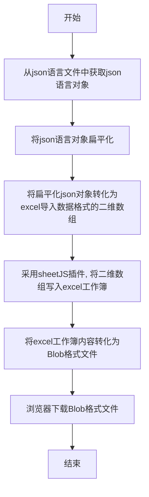
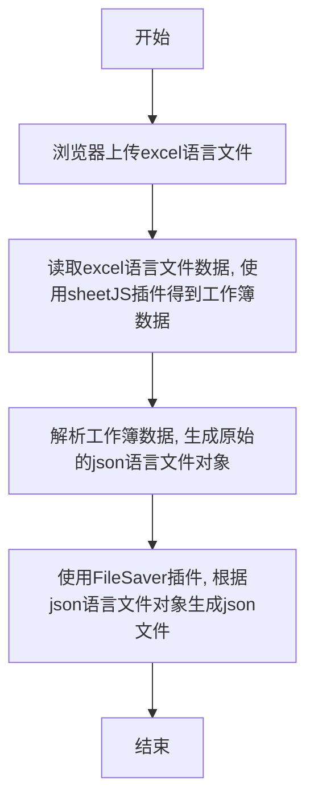

- [背景](#背景)  
- [json语言文件一键导出excel](#json语言文件一键导出excel)
  - [导出流程](#导出流程)  
  - [1、从json文件生成扁平化的json对象](#1、从json文件生成扁平化的json对象)
  - [2、将json对象转化为excel导入数据格式（二维数组），并写入excel工作簿](#2、将json对象转化为excel导入数据格式（二维数组），并写入excel工作簿)
  - [3、将excel工作簿对象保存为Blob类型，并通过浏览器下载](#3、将excel工作簿对象保存为Blob类型，并通过浏览器下载)
- [根据excel生成json语言文件](#根据excel生成json语言文件)
  - [导入流程](#导入流程)
  - [1、上传excel语言文件](#1、上传excel语言文件)
  - [2、使用sheetJS插件读取出工作簿数据](#2、使用sheetJS插件读取出工作簿数据)
  - [3、解析工作簿数据，生成原始的json语言文件对象](#3、解析工作簿数据，生成原始的json语言文件对象)
  - [4、使用FileSaver插件生成json文件](#4、使用FileSaver插件生成json文件)
- [如何支持更多语言](#如何支持更多语言)  
- [demo](#demo)

## 背景

当项目需要支持国际化（即显示多种语言）时，需要专门的翻译人员负责对项目中的文本（对我们来说是中文）进行翻译。由于翻译人员并不直接对接项目代码，故开发人员要把需要翻译的文本组织成常见的可阅读格式（如.excel, .txt, .doc 等等，推荐 excel，可以对齐内容），交给翻译人员，翻译人员翻译完后，开发人员再将翻译内容写回项目中。  
在 vue 项目中，我们采用[vue-i18n](http://kazupon.github.io/vue-i18n/)插件来实现翻译，翻译内容按语言存储在不同的.js 文件中，比如 en.js（英文语言文件）, zh-CN.js（中文语言文件），通常它们是 json 格式的。

```js
// zh-CN.js
export default {
  comp: { // 块级组件
    Input: {
      chose: '选择文件',
      unchosen: '未选择任何文件'
    },
    button: {
      login: '登录',
      logout: '退出',
      confirm: '确定'
    }
  },
  page: { // 页面级组件
    examples: {
      backendPage: '这里是后台管理页面',
      backendPage2: '这里是后台管理页面, 欢迎您，{username}',
      backend: '后台管理'
    }
  }
}

// en.js
export default {
  comp: { // block-level component
    Input: {
      chose: 'Select File',
      unchosen: 'No file is selected.'
    },
    button: {
      login: 'login',
      logout: 'logout',
      confirm: 'confirm'
    }
  },
  page: { // page-level component
    examples: {
      backendPage: 'Here is the background management page.',
      backendPage2: '{username}, welcome to background management page.',
      backend: 'Backstage management'
    }
  }
}
```

因此，开发人员需要将中文文本从 zh-CN.js 中提取出来，整理成上述的可阅读格式（这里采用 excel）。一般来说，开发人员会在中文版本开发完成后，一次性的对 zh-CN.js 进行文本提取（一般翻译人员不属于开发部门，这样的交流成本较低）。  
观察 zh-CN.js 的格式，发现不可以直接把整个文件内容复制黏贴到 excel 中，那样会格式错乱，而是需要将内容一条条复制到 excel 中。比如像下面这样：
  
将上面的 excel 交给翻译人员进行翻译，翻译完开发人员再逐条将翻译文本写回到 en.js 中。如果需要翻译的文本多达千行（笔者曾经参与的一个项目，有 1600 条文本），那开发人员的手动提取翻译文本和写回过程，将是一个比较痛苦的体验，而且容易出错。  
基于上述原因，本文介绍如何**自动地将 json 语言文件一键导出成 excel，以及如何根据翻译好的 excel，自动生成语言文件**。

## json语言文件一键导出excel

### **导出流程**



首先，要建立 json 语言文件中的字段和 excel 中翻译文本的一一对应关系，这样才可以实现后续从 excel 逆向的生成 json 文件。由于 json 语言文件可能嵌套了很多层，不同层可能出现相同的字段，因此考虑将最内层的字段作为 key 值行不通。  
从 vue-i18n 插件的调用方式(\$t('page.examples.backendPage'))得到启发，我们考虑**扁平化导出**，即导出时，将 json 语言文件的字段按路径拼接起来,作为 excel 中的 A 列，将中文文本作为 B 列，待翻译语言（这里以英文为例，其他是类似的）作为 C 列，像下面这样：  
  
这样 excel 从第二行开始的每一行数据，都与 json 语言文件中的一个字段一一对应。
### **1、从json文件生成扁平化的json对象**

```js
/**
 * 将json数据扁平化，多层的key以.拼接成一个
 * @param {} jsonObj 原始json对象，可能含多层
 * @param {*} keyPrefix 用于递归
 * @param {*} result 存储扁平化后的json对象
 */
export function joint(jsonObj, keyPrefix = "", result = {}) {
  for (let word in jsonObj) {
    let tmp = keyPrefix;
    tmp === "" ? (tmp = word) : (tmp += "." + word);
    let value = jsonObj[word];
    if (typeof value === "string") {
      result[tmp] = value;
    } else {
      joint(value, tmp, result);
    }
  }
}
```

得到扁平化 json 对象后，现在要将数据写入 excel 表格。我们采用流行插件[sheetJS](https://github.com/SheetJS/js-xlsx/tree/master/demos/vue)来完成这项工作。
安装 sheetJS

```js
npm install xlsx --save-dev
```

sheetJS 支持写入的数据格式是二维数组，每个元素（即一维数组）对应 excel 中的一行。因此还需要将 json 对象进一步处理，再写入 excel 工作簿。

### **2、将json对象转化为excel导入数据格式（二维数组），并写入excel工作簿**

```js
import XLSX from "xlsx/dist/xlsx.core.min.js";
import chnJson from "../lib/locale/lang/zh-CN.js"; // 导入中文语言文件

let FlatJson = {};
// 将语言包扁平化
joint(chnJson, "", FlatJson);
let data = Object.keys(FlatJson).map(key => [key, FlatJson[key]]);
// 插入表头
data.unshift(["字段", "中文", "英文"]);

let worksheet = XLSX.utils.aoa_to_sheet(data); // 创建一个工作簿
```

现在我们可以创建 excel 文件了，将工作簿保存为[Blob 对象](https://developer.mozilla.org/zh-CN/docs/Web/API/Blob)(一种不可变的类文件对象，可下载)， 然后使用 H5 的新接口[`URL.create​ObjectURL()`](https://developer.mozilla.org/zh-CN/docs/Web/API/URL/createObjectURL)，通过浏览器下载。

### **3、将excel工作簿对象保存为Blob类型，并通过浏览器下载**

```js
let blob = sheet2blob(worksheet);
downExcel(blob);

function downExcel(blob, exportName = "语言包.xlsx") {
  let url = URL.createObjectURL(blob); // 创建blob地址
  let aLink = document.createElement("a");
  aLink.href = url;
  aLink.download = exportName; // HTML5新增的属性，指定保存文件名，可以不要后缀，注意，file:///模式下不会生效
  let event;
  if (window.MouseEvent) event = new MouseEvent("click");
  else {
    event = document.createEvent("MouseEvents");
    event.initMouseEvent(
      "click",
      true,
      false,
      window,
      0,
      0,
      0,
      0,
      0,
      false,
      false,
      false,
      false,
      0,
      null
    );
  }
  aLink.dispatchEvent(event);
}
```

执行上述命令，浏览器就会下载一个'语言包.xlsx'文件，内容如下：
  
**值得说明的是**，上述步骤`2. 将json对象转化为excel导入数据格式（二维数组）,并写入excel工作簿`,其实还可以添加英文，只需得到英文语言文件的扁平化对象，再插入数组中即可。

```js
import XLSX from "xlsx/dist/xlsx.core.min.js";
import chnJson from "../lib/locale/lang/zh-CN.js"; // 导入中文语言文件
import enJson from "../lib/locale/lang/en.js";

// 支持中、英文导出
json2excel(chnJsonObj, enJsonObj = {}, filename = '中文语言包.xlsx') {
  let FlatJsonChn = {};
  let FlatJsonEn = {};
  // 将语言包扁平化
  joint(chnJsonObj, "", FlatJsonChn);
  joint(enJsonObj, "", FlatJsonEn);
  let data = Object.keys(FlatJsonChn).map(key => [
    key,
    FlatJsonChn[key],
    FlatJsonEn[key]
  ]);
  // 插入表头
  data.unshift(["字段", "中文", "英文"]);
  let worksheet = XLSX.utils.aoa_to_sheet(data);

  let blob = sheet2blob(worksheet);

  downExcel(blob, filename);
}

json2excel(chnJson); // 只导出中文
json2excel(chnJson, enJson); // 导出中、英文
```

这样最终导出的'语言包.xlsx'文件，内容如下：


## 根据excel生成json语言文件

### **导入流程**



### **1、上传excel语言文件**
创建一个 input 标签，然后导入文件即可。

### **2、使用sheetJS插件读取出工作簿数据**

```js
import XLSX from "xlsx/dist/xlsx.core.min.js";
let reader = new FileReader();
reader.readAsBinaryString(this.file); // 这里this.file是上传得到的excel文件对象，通过捕捉<input type='file' @change='handleChange'>标签的change事件可得
reader.onload = function(e) {
  var data = e.target.result;
  var wb = XLSX.read(data, { type: "binary" }); // wb.Sheets['sheet1'] 就是所需的工作簿数据
  ...
}
```

### **3、解析工作簿数据，生成原始的json语言文件对象**

```js
/**
 * sheetData格式像下面这样, 至少要有v属性
 * {
 *   ！ref: 'A1:C3',
 *    A1: {t: 's', v: '字段', h: '字段', w: '字段'},
 *    A2: {t: 's', v: 'comp.Input.chose', h: 'comp.Input.chose', w: 'comp.Input.chose'},
 *    A3: {t: 's', v: 'comp.Input.unchosen', h: 'comp.Input.unchosen', w: 'comp.Input.unchosen'},
 *    B1： {t: "s", v: "中文", h: "中文", w: "中文"},
 *    B2: {t: "s", v: "选择文件", h: "选择文件", w: "选择文件"},
 *    B3: {t: "s", v: "未选择任何文件", h: "未选择任何文件", w: "未选择任何文件"},
 *    C1: {t: "s", v: "英文", h: "英文", w: "英文"},
 *    C2: {t: "s", v: "Select File", h: "Select File", w: "Select File"},
 *    C3: {t: "s", v: "No file is selected.", h: "No file is selected.", w: "No file is selected."}
 * }
 * @export
 * @param {*} sheetData
 */
export function parseExcel(sheetData) {
  let chnJson = {};
  let enJson = {};
  for (let key in sheetData) {
    if (key == "!ref") {
      continue;
    }
    let val = sheetData[key].v;
    if (key.startsWith("A")) {
      // 以.拆分成字段数组
      let arra = val.split(".");
      if (arra.length == 1) {
        // 表头
        continue;
      }
      // 遍历
      let tmp = chnJson;
      let tmp2 = enJson;
      for (let i = 0; i < arra.length; i++) {
        let prefix = arra[i];
        if (!tmp[prefix]) {
          if (i < arra.length - 1) {
            tmp[prefix] = {};
            tmp2[prefix] = {};
          } else {
            tmp[prefix] = sheetData[key.replace("A", "B")]
              ? sheetData[key.replace("A", "B")].v
              : "";
            tmp2[prefix] = sheetData[key.replace("A", "C")]
              ? sheetData[key.replace("A", "C")].v
              : "";
          }
        }
        tmp = tmp[prefix];
        tmp2 = tmp2[prefix];
      }
    }
  }
  return [chnJson, enJson];
}

// 调用，接步骤2
var wb = XLSX.read(data, { type: "binary" });
let [chJson, enJson] = parseExcel(wb.Sheets["sheet1"]);
```

### **4、使用[FileSaver](https://github.com/eligrey/FileSaver.js)插件生成json文件**
安装 File-saver

```js
npm install file-saver --save-dev
```

最后将前面的 json 对象，保存到 js 文件中

```js
// 接步骤3
let blob1 = new Blob([JSON.stringify(chnJson)], {
  type: "text/plain;charset=utf-8"
});
saveAs(blob1, "zh-cn.js");
let blob2 = new Blob([JSON.stringify(enJson)], {
  type: "text/plain;charset=utf-8"
});
saveAs(blob2, "en.js");
```

至此，浏览器会生成两个语言文件：zh-cn.js 和 en.js。
**zh-cn.js**

**en.js**

注意这两个文件目前是未格式化过的，读者还需要将它们格式化，可以访问一些格式化网站，比如：
<a href="https://www.sojson.com/jshtml.html" target="_blank">https://www.sojson.com/jshtml.html</a>

## 如何支持更多语言

前面的例子，介绍了中、英文两种语言。事实上，简单的修改就可以支持到3种甚至更多的语言。  
- **多种语言文件导出excel。**
简单的修改上述代码，将`json2excel(chnJsonObj, enJsonObj = {}, filename = '中文语言包.xlsx'){}`的参数调用改为
`json2excel(langJsonObjArra, filename = '中文语言包.xlsx')`, `langJsonObjArra`为传入的json语言对象，然后在函数体重遍历该数组，逐一扁平化，转化为excel支持的数组格式，最后进行下载即可。  

- **从包含多种语言翻译的excel文件生成语言包。**
将`parseExcel(sheetData)`改为`parseExcel(sheetData, col = 2)`, `col`表示语言总类，默认2种。一般来说，excel的第1列是拼接字段，第2到第`col+1`列对应`col`种语言，在函数体中，参照原来的实现，遍历第2到第`col+1`列(如中、英文就是遍历B、C列), 即可得到所有的json语言对象。
## demo

我们已经将这两个工具集成到自己定制的 vue项目模板中，可以访问  
<a href="https://feiniao111.github.io/vueWebTpl-live/#/examples/internUsage" target="_blank">https://feiniao111.github.io/vueWebTpl-live/#/examples/internUsage</a>
进行体验。  

完整可运行的代码，请访问
<a href="https://github.com/feiniao111/vueWebTpl" target="_blank">https://github.com/feiniao111/vueWebTpl</a>
